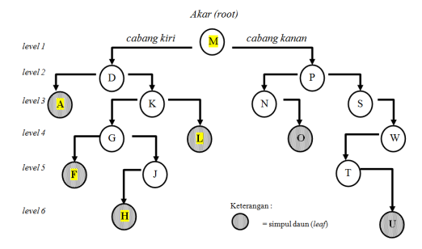

# POHON BINER

## Capaian Belajar

Dapat mengimplementasikan penggunaan Simpul milik Double Linked List untuk pembuatan pohon.

## Dasar Teori

Tree(binary tree) adalah pohon dimana setiap simpulnya (node) hanya boleh memiliki <b>maksimal</b> 2 anak (dari cabang kiri, dan kanan).

Simpul(node) :
- Simpul anak (children) hanya boleh punya 1 <i>parent</i>
- Simpul orang tua (<i>parrent</i>) hanya boleh punya <b>maksimal</b> 2 anak, namun boleh juga tidak punya anak

simpul <b><i>Akar</i></b> adalah simpul yang tidak memiliki <i>Parent</i>
simpul <b><i>Daun</i></b> adalah simpul yang tidak memiliki anak <i>Children</i>

Cabang di dalam pohon biner terdiri dari <b>cabang kiri, cabang kanan</b>

# Ilustrasi Pohon Tree

